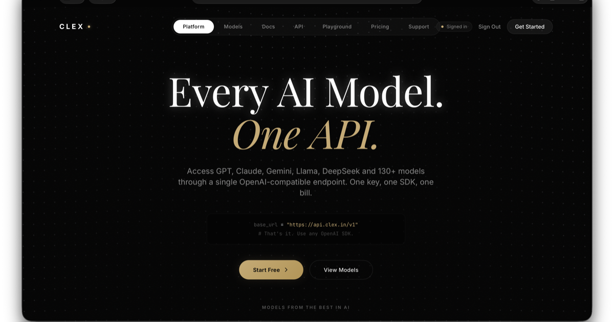
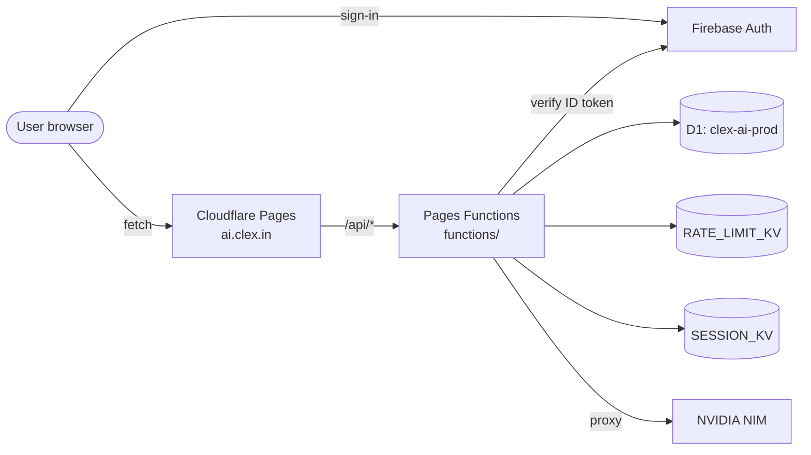

<!-- =====================================================================
     Clex AI · ai.clex.in
     The Ultimate AI Wrapper API — one endpoint, every model.
     ===================================================================== -->

<div align="center">



# Clex AI &nbsp;·&nbsp; **One endpoint. Every model.**

### A unified, OpenAI-compatible AI gateway running on Cloudflare Pages + Workers.

<a href="https://ai.clex.in"></a>
<a href="https://ai.clex.in/docs.html"></a>
<a href="https://ai.clex.in/playground.html"></a>
<a href="https://ai.clex.in/pricing.html"></a>

</div>

---

## Architecture

Clex AI runs **entirely on Cloudflare**:

| Surface | URL | What it is |
| --- | --- | --- |
| Marketing site + dashboard SPA + admin SPA | `ai.clex.in` | Cloudflare Pages serving everything in `public_assets/` |
| User dashboard | `ai.clex.in/dashboard/` | Vanilla JS SPA — Firebase Auth + `/api/me` + `/api/keys` + `/api/usage` |
| Admin panel | `ai.clex.in/admin/` | Vanilla JS SPA — passkey + admin-secret login + user/plan/audit views |
| Public API | `api.ai.clex.in/v1/...` &nbsp;and&nbsp; `ai.clex.in/api/...` | Pages Functions in `functions/` |

Storage:

- **D1** (`clex-ai-prod`) — users, API keys, subscriptions, daily usage, request logs, IP audit, admin login + passkey + plan-change events. See [`migrations/0001_init.sql`](./migrations/0001_init.sql).
- **KV namespace `RATE_LIMIT_KV`** — rate-limit counters (sliding minute window + UTC daily quota).
- **KV namespace `SESSION_KV`** — admin sessions + WebAuthn challenges.
- **Cloudflare Secrets** — `CLEX_API_KEY` (NVIDIA upstream), `ADMIN_SECRET`, `WEBAUTHN_RP_ID`, `WEBAUTHN_ORIGIN`, `FIREBASE_PROJECT_ID`.



---

## Plans &amp; rate limits

| Plan | Price | Requests / day | Burst / minute |
| --- | --- | --- | --- |
| Free | $0 | 20 | 1 |
| Starter | $2 / mo · _coming soon_ | 200 | 5 |
| Pro | $5 / mo · _coming soon_ | 2,000 | 20 |
| Developer (admin only) | n/a | 100,000 | 60 |

Plans are stored as `subscriptions` rows in D1. The admin panel grants `Starter` / `Pro` for a chosen duration (1 mo, 3 mo, 6 mo, 1 yr, lifetime). Auto-billing through Stripe / Razorpay is intentionally **not** wired up yet.

---

## API surface

| Method | Path | Purpose |
| --- | --- | --- |
| `POST` | `/api/chat` &amp; `/v1/chat/completions` | OpenAI-compatible chat (rate-limited per `clex_*` API key) |
| `GET`  | `/api/health` | Liveness probe |
| `GET`  | `/api/me` | Logged-in user — plan, live counters, limits |
| `GET`  | `/api/keys` &nbsp;·&nbsp; `POST` | List + create `clex_*` API keys |
| `DELETE` | `/api/keys/:id` | Revoke a key |
| `GET`  | `/api/usage` | 30-day daily usage history |
| `POST` | `/api/admin/login` | Admin secret login |
| `POST` | `/api/admin/login/passkey/begin` &amp; `.../finish` | WebAuthn admin login |
| `GET`  | `/api/admin/me` &nbsp;·&nbsp; `POST /api/admin/logout` | Session probe + sign-out |
| `GET`  | `/api/admin/users` &nbsp;·&nbsp; `GET /api/admin/users/:id` | User list + detail |
| `POST` | `/api/admin/users/:id/plan` &nbsp;·&nbsp; `DELETE /api/admin/users/:id` | Upgrade / downgrade / delete |
| `GET`  | `/api/admin/stats` &nbsp;·&nbsp; `/api/admin/audit` &nbsp;·&nbsp; `/api/admin/feeds` | Aggregate counters, audit timeline, request feed |
| `GET`  | `/api/admin/passkeys` &nbsp;·&nbsp; `DELETE /api/admin/passkeys/:id` | List / remove registered passkeys |
| `POST` | `/api/admin/passkeys/register/begin` &amp; `.../finish` | Enroll a new passkey for the operator |

End users authenticate with Firebase ID tokens (`Authorization: Bearer <id_token>`); API callers authenticate with `clex_*` keys via `Authorization: Bearer clex_xxx` or `x-clex-api-key: clex_xxx`.

---

## Local dev

```bash
git clone https://github.com/Abhnv07/clex-ai.git
cd clex-ai

# Install wrangler globally (one-time)
npm install -g wrangler

# Log in to Cloudflare
wrangler login

# Apply the D1 migration locally
wrangler d1 execute clex-ai-prod --local --file migrations/0001_init.sql

# Run Pages locally with Functions
wrangler pages dev public_assets --d1 DB --kv RATE_LIMIT_KV --kv SESSION_KV
```

Open [http://localhost:8788/dashboard/](http://localhost:8788/dashboard/) and [http://localhost:8788/admin/](http://localhost:8788/admin/).

---

## Deploying

```bash
# 1. Push the migration to the production D1 instance
wrangler d1 execute clex-ai-prod --remote --file migrations/0001_init.sql

# 2. Set required secrets (one time)
wrangler pages secret put CLEX_API_KEY        --project-name clex-ai
wrangler pages secret put ADMIN_SECRET        --project-name clex-ai
wrangler pages secret put FIREBASE_PROJECT_ID --project-name clex-ai
wrangler pages secret put WEBAUTHN_RP_ID      --project-name clex-ai   # ai.clex.in
wrangler pages secret put WEBAUTHN_ORIGIN     --project-name clex-ai   # https://ai.clex.in

# 3. Deploy
wrangler pages deploy public_assets --project-name clex-ai
```

Cloudflare automatically picks up `wrangler.toml` for the D1 + KV bindings.

---

## Project layout

```text
clex-ai/
├── wrangler.toml               # Pages bindings: D1 (DB), KV (RATE_LIMIT_KV, SESSION_KV)
├── migrations/0001_init.sql    # D1 schema
├── functions/                  # Pages Functions (TypeScript)
│   ├── lib/                    # Shared helpers: respond, crypto, d1, kv, plans, quota, firebase, admin, webauthn
│   ├── api/                    # /api/* user-facing routes
│   │   ├── me.ts · keys/ · usage.ts · chat.ts
│   │   └── admin/              # /api/admin/* operator routes
│   └── v1/chat/completions.ts  # OpenAI-compatible alias
└── public_assets/              # Pages output (no build step)
    ├── index.html · docs.html · pricing.html · login.html · ...
    ├── shared.css · shared.js · models-data.js · favicon.png · preview.png
    ├── dashboard/              # User dashboard SPA
    └── admin/                  # Admin panel SPA (no public link)
```

---

<div align="center">
  <sub>Built by <a href="https://abhnv.in"><b>Abhinav Raj</b></a> · running on <a href="https://www.cloudflare.com/developer-platform/pages/">Cloudflare Pages</a> + <a href="https://www.cloudflare.com/developer-platform/d1/">D1</a> + <a href="https://www.cloudflare.com/developer-platform/workers-kv/">KV</a>.</sub>
</div>
