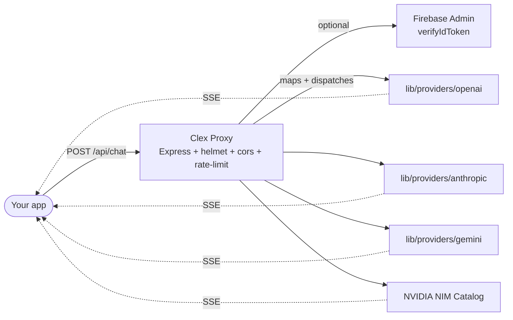

<!-- =====================================================================
     Clex AI · ai.clex.in
     The Ultimate AI Wrapper API — one endpoint, every model.
     ===================================================================== -->

<div align="center">


# 🧠 Clex AI &nbsp;·&nbsp; **One endpoint. Every model.**

### A unified, OpenAI-compatible API gateway that fans out to dozens of leading LLMs — DeepSeek, Llama, Qwen, Mistral, GPT-OSS, GLM, Kimi, Minimax, NVIDIA Nemotron, and more.

<a href="https://clex.in"></a>
<a href="https://clex.in/docs.html"></a>
<a href="https://clex.in/playground.html"></a>
<a href="https://clex.in/models.html"></a>
<a href="https://clex.in/pricing.html"></a>

<br />

<a href="https://github.com/Abhinavv-007/clex-ai/stargazers"></a>
<a href="https://github.com/Abhinavv-007/clex-ai/commits/main"></a>


<br />

<sub><b>OpenAI-compatible · zero-retention · ultra-low latency · streaming SSE</b></sub>

</div>

<br />

---

## ✦ Why Clex AI

> Clex AI is a **single OpenAI-compatible HTTP endpoint** that proxies to a curated catalog of frontier and specialty LLMs. You stop juggling provider keys, SDKs, response shapes, and rate-limit envelopes. You write one `fetch`, one OpenAI client, or use the in-browser playground — and you can swap models with a single string.

<table>
  <tr>
    <td width="50%" valign="top">
      <h3>🔌 Unified API</h3>
      <p>One endpoint. Connect to <b>DeepSeek</b>, <b>Llama Nemotron</b>, <b>Qwen 3.5</b>, <b>GPT-OSS</b>, <b>GLM 5/4.7</b>, <b>Kimi K2.5</b>, <b>Minimax M2.x</b>, <b>Mistral</b>, and more — through one <code>POST /api/chat</code>.</p>
    </td>
    <td width="50%" valign="top">
      <h3>🛡 Zero-retention privacy</h3>
      <p>Prompt strings and completions are <b>never logged or stored</b>. The proxy is built thin on purpose — it doesn't hold what it doesn't need.</p>
    </td>
  </tr>
  <tr>
    <td width="50%" valign="top">
      <h3>⚡ Ultra-low latency</h3>
      <p>A custom edge proxy with helmet, CORS, rate limiting, and SSE streaming. Tokens pop into your terminal as they're generated.</p>
    </td>
    <td width="50%" valign="top">
      <h3>🎨 Live playground</h3>
      <p>An in-browser sandbox at <a href="https://clex.in/playground.html"><code>/playground</code></a> with model presets, chat history, system prompts, and a coding/RAG/agentic guide library.</p>
    </td>
  </tr>
  <tr>
    <td width="50%" valign="top">
      <h3>🔐 Optional Firebase auth</h3>
      <p>Set <code>REQUIRE_AUTH=true</code> + <code>FIREBASE_SERVICE_ACCOUNT_JSON</code> to gate the proxy behind verified Firebase ID tokens. Off by default for self-hosters.</p>
    </td>
    <td width="50%" valign="top">
      <h3>🧪 OpenAI-compatible</h3>
      <p>Drop in any OpenAI client by pointing <code>baseURL</code> at <code>https://clex.in</code> and <code>apiKey</code> at your <code>clex_*</code> key. Streaming, system prompts, temperature, max_tokens — all there.</p>
    </td>
  </tr>
</table>

---

## ✦ Quickstart — In 30 seconds

### cURL — one POST, streaming or not

```bash
curl https://clex.in/api/chat \
  -H "Content-Type: application/json" \
  -H "x-clex-api-key: clex_your_key_here" \
  -d '{
    "model": "qwen/qwen3.5-122b-a10b",
    "messages": [
      { "role": "system", "content": "You are a precise assistant." },
      { "role": "user",   "content": "Explain QUIC in 3 bullet points." }
    ],
    "temperature": 0.4,
    "stream": true
  }'
```

### Node — OpenAI SDK

```ts
import OpenAI from "openai";

const clex = new OpenAI({
  baseURL: "https://clex.in/api",          // or your self-hosted URL
  apiKey:  "clex_your_key_here",
  // pass via header alternatively:
  defaultHeaders: { "x-clex-api-key": "clex_your_key_here" },
});

const stream = await clex.chat.completions.create({
  model: "deepseek/deepseek-v3",
  stream: true,
  messages: [
    { role: "system", content: "Answer like a senior staff engineer." },
    { role: "user",   content: "Compare KV vs D1 vs R2 in 1 paragraph." },
  ],
});

for await (const chunk of stream) {
  process.stdout.write(chunk.choices[0]?.delta?.content ?? "");
}
```

### Python — `openai` SDK

```python
from openai import OpenAI

clex = OpenAI(
    base_url="https://clex.in/api",
    api_key="clex_your_key_here",
)

resp = clex.chat.completions.create(
    model="qwen/qwen3.5-397b-a17b",
    messages=[{"role": "user", "content": "Write a haiku about Bangalore traffic."}],
    temperature=0.6,
)
print(resp.choices[0].message.content)
```

> Authentication accepts either header form: `x-clex-api-key: clex_xxx` **or** `Authorization: Bearer clex_xxx`.

---

## ✦ API Reference

| Method | Endpoint | Purpose |
| --- | --- | --- |
| `POST` | `/api/chat` | OpenAI-compatible chat completions (streaming + non-streaming) |
| `POST` | `/api/playground/chat` | Auth-gated playground proxy (used by the in-browser sandbox) |
| `GET`  | `/api/health` | Service health probe |
| `POST` | `/api/support/contact` | Support-form submission (Resend-backed) |

### Request schema (`/api/chat`)

```jsonc
{
  "model":       "qwen/qwen3.5-122b-a10b",  // required
  "messages":    [
    { "role": "system",    "content": "..." },
    { "role": "user",      "content": "..." },
    { "role": "assistant", "content": "..." },
    { "role": "tool",      "content": "..." }
  ],
  "temperature": 0.4,                       // 0..2
  "max_tokens":  2048,                      // ≤ 32768
  "stream":      true                       // SSE deltas
}
```

### Auth header

| Header | Form |
| --- | --- |
| `x-clex-api-key` | `clex_xxx...` (preferred) |
| `Authorization`  | `Bearer clex_xxx...` |
| `Authorization`  | `Bearer <Firebase ID token>` (if `REQUIRE_AUTH=true`) |

### Streaming response (SSE)

Each chunk follows the OpenAI delta shape:

```text
data: { "id":"...", "choices":[{ "delta":{ "content":"Hello" }, "index":0 }] }
data: { "id":"...", "choices":[{ "delta":{ "content":" world" }, "index":0 }] }
data: [DONE]
```

---

## ✦ Architecture



> The proxy runs **stateless** by design. There is no DB. There is no cache of your prompts. Rate limits live in memory.

---

## ✦ Model Catalog (excerpt)

The full live catalog ships at [`/models.html`](https://clex.in/models.html) and is sourced from `models-data.js`. Highlights:

| Family | Examples | Use |
| --- | --- | --- |
| Llama Nemotron | `nvidia/llama-nemotron-rerank-1b-v2` | Retrieval / reranking |
| Qwen | `qwen/qwen3.5-122b-a10b`, `qwen/qwen3.5-397b-a17b` | Chat, code, reasoning, vision |
| GLM | `zhipuai/glm5`, `zhipuai/glm4.7` | Reasoning, agentic, tool calling |
| Minimax | `minimaxai/minimax-m2.5`, `minimax-m2.1` | Coding, agentic, app/web dev |
| Stepfun | `stepfun-ai/step-3.5-flash` | Reasoning |
| Moonshot | `moonshotai/kimi-k2.5` | Multimodal, video |
| DeepSeek · GPT-OSS · Mistral | _(many)_ | General + specialty |

---

## ✦ Tech Stack

<p>
  
  
  
  
  
  <br/>
  
  
  
  
</p>

---

## ✦ Local Dev

```bash
git clone https://github.com/Abhinavv-007/clex-ai.git
cd clex-ai
npm install

# Required for AI traffic (legacy fallback also supports NVIDIA_API_KEY)
export CLEX_API_KEY="clex_xxx"

# Optional gates
export REQUIRE_AUTH=true
export FIREBASE_SERVICE_ACCOUNT_JSON='{ ... }'
export ALLOWED_ORIGIN="https://yourapp.com"
export RATE_LIMIT_WINDOW_MS=60000
export RATE_LIMIT_MAX=120
export JSON_BODY_LIMIT=1mb

npm run dev   # node server.js → http://localhost:3000
```

The static site (landing, docs, playground, models, pricing, login) is served directly from the same Express process — `server.js` mounts the repo root with `express.static`.

---

## ✦ Project Layout

```text
clex-ai/
├── server.js                   # Express proxy: /api/chat, /api/playground/chat, /api/health, /api/support/contact
├── lib/
│   ├── sse.js                  # SSE helpers (writeSSE, OpenAI delta shape, [DONE])
│   └── providers/
│       ├── openai.js           # openaiChat
│       ├── anthropic.js        # anthropicMessages
│       └── gemini.js           # geminiGenerateContent
├── models-data.js              # full model catalog exposed to /models.html
├── models.html, docs.html,
│   playground.html, pricing.html,
│   privacy.html, support.html,
│   guide-*.html                # marketing + docs site
├── frontend/                   # extra Vite/React surface
├── dashboard/, backend/        # supporting subprojects
└── package.json                # name: clex-api, version: 2.0.0
```

---

## ✦ Environment Variables

| Var | Required | Default | Purpose |
| --- | :---: | --- | --- |
| `CLEX_API_KEY` | ✅ | — | Upstream provider key (NVIDIA NIM / OpenAI compatible). Legacy fallback `NVIDIA_API_KEY` accepted. |
| `PORT` | | `3000` | HTTP port |
| `ALLOWED_ORIGIN` | | `*` | If set, CORS only allows this origin |
| `JSON_BODY_LIMIT` | | `1mb` | Max request body |
| `RATE_LIMIT_WINDOW_MS` | | `60000` | Rate limit window |
| `RATE_LIMIT_MAX` | | `120` | Requests per window per IP |
| `REQUIRE_AUTH` | | `false` | If `true`, enforce Firebase auth on `/api/chat` |
| `FIREBASE_SERVICE_ACCOUNT_JSON` | | — | Service account JSON for Firebase Admin |

---

## ✦ Roadmap

- [x] OpenAI-compatible `/api/chat` with SSE streaming
- [x] In-browser playground with model presets + history
- [x] Firebase-gated auth path
- [x] Per-IP rate limiting + Helmet hardening
- [ ] Per-key usage analytics dashboard
- [ ] Built-in retry + provider failover
- [ ] Embedding endpoints

---

## ✦ Star History

<a href="https://star-history.com/#Abhinavv-007/clex-ai&Date">
  
</a>

---

<div align="center">
  <sub>🧠 Built by <a href="https://abhnv.in"><b>Abhinav Raj</b></a> · part of the <a href="https://github.com/Abhinavv-007/clex">Clex</a> family.</sub>
  <br/>
  <a href="https://abhnv.in">Portfolio</a> · <a href="https://www.linkedin.com/in/abhnv07/">LinkedIn</a> · <a href="https://x.com/Abhnv007">X</a> · <a href="https://www.instagram.com/abhinavv.007/">Instagram</a>
</div>
